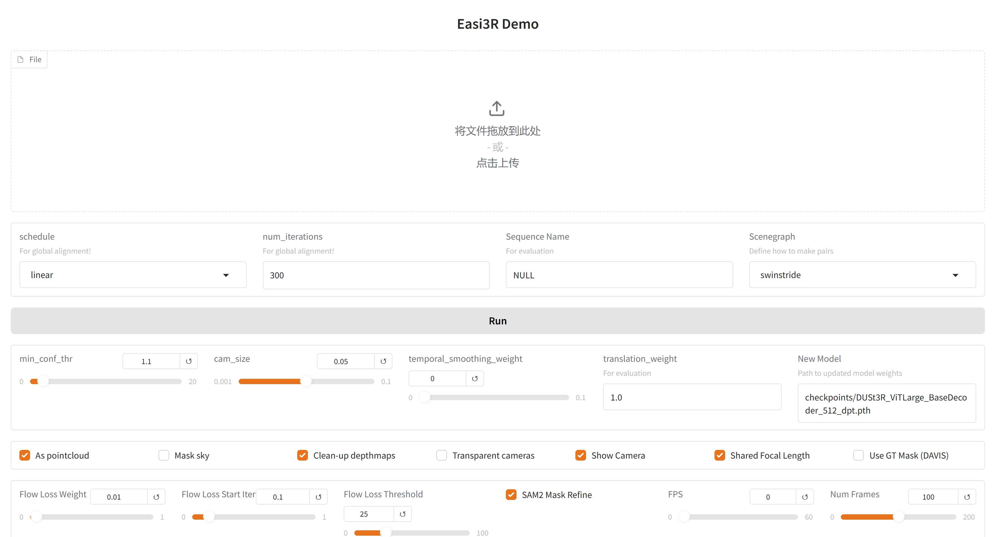
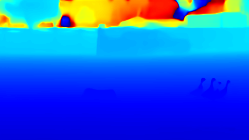
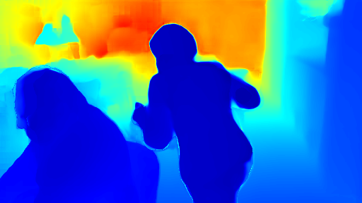
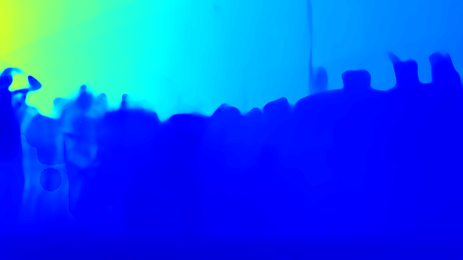
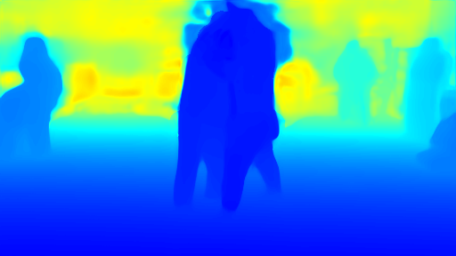

<div align="center">
<h1>测试 Easi3R: Estimating Disentangled Motion from DUSt3R Without Training</h1>
</div>

## 配置

```bash
git clone https://github.com/KwanWaiPang/Easi3R.git

# rm -rf .git
conda create -n easi3r python=3.10 cmake=3.31
conda activate easi3r
# conda remove --name easi3r --all

conda install pytorch torchvision pytorch-cuda=12.1 -c pytorch -c nvidia  # use the correct version of cuda for your system
pip install -r requirements.txt

# install 4d visualization tool
pip install -e viser

# install SAM2
pip install -e third_party/sam2 --verbose

# compile the cuda kernels for RoPE (as in CroCo v2).
# DUST3R relies on RoPE positional embeddings for which you can compile some cuda kernels for faster runtime.
cd croco/models/curope/
python setup.py build_ext --inplace
cd ../../../

```

然后下载权重文件,包括了DUSt3R, MonST3R, RAFT 以及 SAM2四个模型的权重（后面3个应该是monst3r需要用到作对比的）

```bash
# download the weights
cd data
bash download_ckpt.sh
cd ..
```

## 测试
通过运行下面代码来执行交互demo(用vscode运行点击网页即可打开交互界面),结果会存放在`demo_tmp/{Sequence Name}`中

```bash
cd Easi3R/
conda activate easi3r
OPENBLAS_NUM_THREADS=1 CUDA_VISIBLE_DEVICES=0 python demo.py \
    --weights checkpoints/DUSt3R_ViTLarge_BaseDecoder_512_dpt.pth 

# To change backbone(改为用monst3r对比), --weights checkpoints/MonST3R_PO-TA-S-W_ViTLarge_BaseDecoder_512_dpt.pth
```

<div align="center">
  
<figcaption>  
</figcaption>
</div>


* 也可以采用下面的没有交互界面的模式：

```bash
OPENBLAS_NUM_THREADS=1 CUDA_VISIBLE_DEVICES=0 python demo.py --input demo_data/dog-gooses \
    --output_dir demo_tmp --seq_name dog-gooses \
    --weights checkpoints/DUSt3R_ViTLarge_BaseDecoder_512_dpt.pth 

# To change backbone, --weights checkpoints/MonST3R_PO-TA-S-W_ViTLarge_BaseDecoder_512_dpt.pth
# To use SAM2, add: --sam2_mask_refine
# use video as input: --input demo_data/dog-gooses.mp4 
# reduce the memory cost: set maximum number of frames used from video --num_frames 65 
# faster video option: down sample the video fps to --fps 5
```

* 而可视化交互的4D结果可通过运行下面代码：

~~~
python viser/visualizer.py --data demo_tmp/dog-gooses --port 9081
~~~


* 对于其他数据集下载，可运行下面代码。不过之前已经下载好在目录`/home/gwp/monst3r/data/davis_videos`下了，因此直接调用即可~

```bash
cd data; python download_prepare_davis.py; cd ..

#测试lady-running
OPENBLAS_NUM_THREADS=1 CUDA_VISIBLE_DEVICES=0 python demo.py --input /home/gwp/monst3r/demo_data/lady-running.mp4 \
    --output_dir demo_tmp --seq_name lady-running \
    --weights checkpoints/DUSt3R_ViTLarge_BaseDecoder_512_dpt.pth 

#测试breakdance
OPENBLAS_NUM_THREADS=1 CUDA_VISIBLE_DEVICES=0 python demo.py --input /home/gwp/monst3r/data/davis_videos/breakdance.mp4 \
    --output_dir demo_tmp --seq_name breakdance \
    --weights checkpoints/DUSt3R_ViTLarge_BaseDecoder_512_dpt.pth 

#测试judo
OPENBLAS_NUM_THREADS=1 CUDA_VISIBLE_DEVICES=0 python demo.py --input /home/gwp/monst3r/data/davis_videos/judo.mp4 \
    --output_dir demo_tmp --seq_name judo \
    --weights checkpoints/DUSt3R_ViTLarge_BaseDecoder_512_dpt.pth 

```

生成的动态depth map如下图所示

<div align="center">
  <table style="border: none; background-color: transparent;">
    <tr align="center">
      <td style="width: 50%; border: none; padding: 0.01; background-color: transparent; vertical-align: middle;">
        
        dog-gooses
      </td>
      <td style="width: 50%; border: none; padding: 0.01; background-color: transparent; vertical-align: middle;">
        
        lady-running
      </td>
    </tr>
    <tr align="center">
      <td style="width: 50%; border: none; padding: 0.01; background-color: transparent; vertical-align: middle;">
        
        breakdance
      </td>
      <td style="width: 50%; border: none; padding: 0.01; background-color: transparent; vertical-align: middle;">
        
        judo
      </td>
    </tr>
  </table>
  <figcaption>
  </figcaption>
</div>


具体的实验效果请见博客可视化4D pointmap

